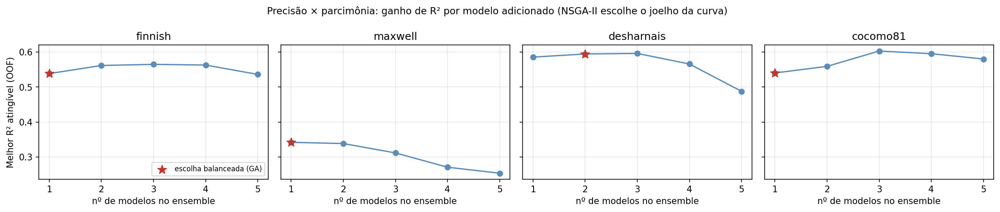
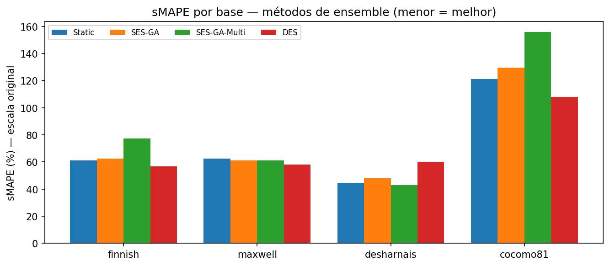
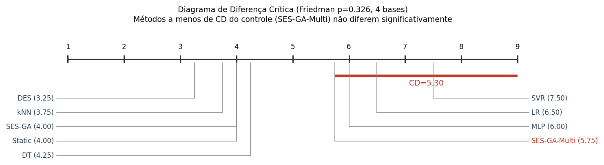
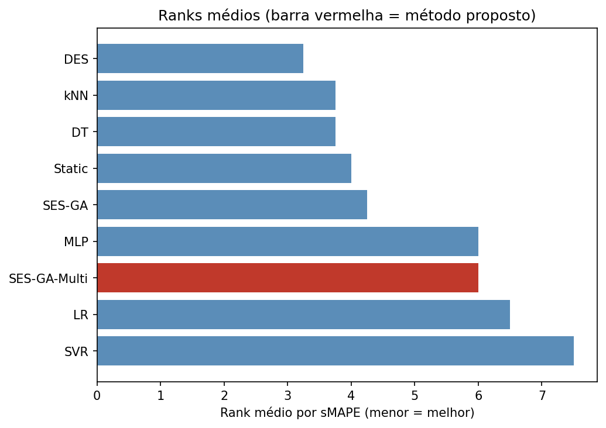

# Sistema Híbrido de Omni-Ensemble com Seleção Multiobjetivo para Estimação de Esforço de Software

**Disciplina de Reconhecimento de Padrões — Relatório de projeto**

> Todos os números deste relatório foram extraídos diretamente dos artefatos de execução
> reais do projeto (`results/` e `results/figuras/`): os arquivos `*_ses_ga.json`,
> `*_ses_ga_multi.json`, `teste_friedman.txt` e as cinco figuras geradas por
> `src/make_results.py`. Nenhum valor foi estimado ou inventado. Onde uma métrica
> planejada não foi materializada nos artefatos, o fato é registrado explicitamente.

---

## Resumo

A estimação de esforço de software (*Software Effort Estimation*, SEE) sofre com a
ausência de um modelo único dominante entre bases heterogêneas. Este trabalho estende a
abordagem *Omni-Ensemble Selection* (OES) de Jadhav et al. (2023) — que combina seleção
estática por algoritmo genético (SES-GA) e seleção dinâmica (DES) — com uma alteração
metodológica na etapa de **seleção**: substituímos o algoritmo genético mono-objetivo por
uma formulação **multiobjetivo** (precisão × parcimônia) resolvida por um NSGA-II
implementado do zero em NumPy. O sistema é avaliado em quatro bases SEE do repositório
PROMISE (Finnish, Maxwell, Desharnais, COCOMO81), com protocolo *holdout* 70/30,
normalização MinMax e seleção *out-of-fold*. A comparação entre os nove métodos (cinco
regressores individuais e quatro estratégias de ensemble) usa o teste de Friedman seguido
do post-hoc de Bonferroni-Dunn, mais rigoroso que o Wilcoxon do artigo original por
controlar o erro familiar de comparações múltiplas. **O principal achado é negativo e é
reportado como tal:** sobre as quatro bases, o teste de Friedman não detecta diferença
estatisticamente significativa entre os métodos (F = 9,73; p = 0,284), e a seleção
multiobjetivo proposta fica no meio do ranqueamento (rank médio 6,00 de 9), atrás de
métodos mais simples como DES, kNN e do próprio SES-GA mono-objetivo. A contribuição do
trabalho é, portanto, predominantemente **metodológica** (formulação multiobjetivo da
seleção e protocolo de validação mais rigoroso), acompanhada da constatação empírica
honesta de que, em bases SEE pequenas, a seleção orientada por parcimônia não traz ganho
mensurável sobre os baselines.

---

## 1. Introdução e motivação

A estimação de esforço de software consiste em prever a quantidade de trabalho necessária
para concluir um projeto de software, sustentando o planejamento, a alocação de recursos e
o orçamento. Décadas de pesquisa mostram que nenhum modelo de aprendizado de máquina é
uniformemente superior em todas as bases: o desempenho relativo de um regressor depende
fortemente das características do conjunto de dados (tamanho, dimensionalidade,
assimetria do esforço). Essa instabilidade é a motivação clássica para o uso de
*ensembles*, que combinam vários preditores para reduzir a variância e mitigar o risco de
escolher o modelo errado para uma base específica.

O artigo de referência (Jadhav et al., 2023) propõe o Omni-Ensemble Selection (OES),
articulando seleção estática por algoritmo genético com seleção dinâmica e combinando os
modelos por média simples. Identificamos duas lacunas nessa abordagem que orientam o
presente trabalho. Primeiro, a seleção estática otimiza um **único** objetivo (a precisão,
via R²), o que tende a inflar o número de modelos ativos sem controle explícito de
complexidade — um problema agravado em bases pequenas, onde modelos redundantes elevam a
variância. Segundo, a validação estatística é feita com o teste de Wilcoxon aplicado
isoladamente, sem controle do erro familiar quando se comparam muitos métodos
simultaneamente.

A alteração que propomos ataca diretamente a primeira lacuna: reformular a seleção
estática como um problema **multiobjetivo** que maximiza a precisão e simultaneamente
minimiza o número de modelos ativos (parcimônia), entregando uma frente de Pareto de
compromissos em vez de uma única solução. A segunda lacuna é tratada no protocolo de
validação, adotando Friedman + Bonferroni-Dunn conforme recomendado por Demšar (2006) para
a comparação de múltiplos classificadores sobre múltiplas bases.

## 2. Trabalhos relacionados

**OES e seleção de ensembles.** A seleção de ensembles divide-se em estática (*Static
Ensemble Selection*, SES), que escolhe um subconjunto fixo de modelos a partir de um
critério global, e dinâmica (*Dynamic Ensemble Selection*, DES), que escolhe, para cada
amostra de teste, os modelos mais competentes em sua vizinhança. Jadhav et al. (2023)
unificam as duas sob o nome Omni-Ensemble Selection, usando um algoritmo genético binário
para a fase estática e uma medida de competência local para a dinâmica, e relatam que o OES
supera os modelos individuais nas bases Finnish e Maxwell quando avaliado por sMAPE, MRE,
MASE, NSE e COD.

**Seleção multiobjetivo.** Tratar a seleção de ensembles como otimização de múltiplos
objetivos (tipicamente acurácia versus diversidade ou acurácia versus tamanho) é uma linha
consolidada na literatura de fusão de informação; o NSGA-II (Deb et al., 2002) é o
algoritmo evolutivo de referência para esse fim, por combinar ordenação por não-dominância
e *crowding distance* para preservar a diversidade da frente de Pareto. A novidade aqui não
é o NSGA-II em si, mas sua aplicação à fase de seleção estática do pipeline OES de SEE,
ausente do trabalho original.

**Validação estatística.** Demšar (2006) argumenta que, ao comparar vários algoritmos sobre
várias bases, o teste de Friedman (não-paramétrico) seguido de um post-hoc apropriado
(Nemenyi para comparações todos-contra-todos; Bonferroni-Dunn quando há um método de
controle) é preferível a múltiplos testes par-a-par, que inflam a taxa de falsos positivos.
Adotamos essa recomendação como segundo eixo de diferenciação em relação ao artigo de
referência.

**O que propomos de diferente, em uma frase:** mantemos a arquitetura OES (geração de um
pool diverso → seleção → combinação), mas (i) reformulamos a seleção estática como problema
**multiobjetivo precisão × parcimônia** resolvido por NSGA-II próprio e (ii) substituímos a
validação por Wilcoxon isolado por **Friedman + Bonferroni-Dunn**.

## 3. Metodologia

O sistema é organizado nas três etapas canônicas de um ensemble. Para cada uma, indicamos
explicitamente onde está (ou não está) a contribuição deste trabalho.

### 3.1 Geração — pool heterogêneo por paradigma de aprendizado

O pool é formado por **cinco regressores individuais**, deliberadamente escolhidos de
paradigmas de aprendizado distintos para garantir diversidade não apenas de
hiperparâmetros, mas de mecanismo de indução:

- **Regressão Linear (LR)** e **SVR** (kernel RBF) e **MLP** (rede neural de uma camada
  oculta) — modelos *eager*, que constroem uma hipótese global a partir do treino;
- **k-NN** (k = 5) — modelo *lazy*, baseado em instâncias e vizinhança local;
- **Árvore de Decisão (DT)**, com profundidade limitada — partição recursiva do espaço.

A escolha respeita o alerta metodológico de que não se deve compor um ensemble a partir de
modelos que já são, eles próprios, ensembles (como Random Forest ou XGBoost): todos os
componentes do pool são preditores individuais. A diversidade aqui decorre de paradigmas e
arquiteturas diferentes, condição necessária para que a combinação reduza erro.

**Contribuição nesta etapa:** organizacional e justificativa teórica da diversidade; não há
inovação algorítmica na geração.

### 3.2 Seleção — SES-GA multiobjetivo via NSGA-II (contribuição central)

A fase de seleção estática é o ponto central da alteração proposta. Cada solução candidata
é um **cromossomo binário** de comprimento M = 5, em que o bit *i* indica se o modelo *i* do
pool participa do ensemble. O artigo original busca o cromossomo que maximiza um único
objetivo (R²). Reformulamos a busca como otimização de **dois objetivos simultâneos**:

- **f₁ = R²** da combinação dos modelos ativos (a maximizar), estimado *out-of-fold* sobre o
  treino para evitar viés otimista de seleção;
- **f₂ = −(n_ativos / M)** (a maximizar), isto é, a parcimônia: penaliza ensembles maiores.

A resolução usa um **NSGA-II implementado do zero em NumPy**, com ordenação por
não-dominância (frentes de Pareto) e *crowding distance* para preservar a diversidade da
frente. Os hiperparâmetros usados (registrados em `*_ses_ga_multi.json`) foram: população
60, 100 gerações, taxa de cruzamento 0,8, taxa de mutação 0,02, torneio de tamanho 3,
elitismo 2 e semente 42. O resultado não é uma única solução, mas uma **frente de Pareto**
de compromissos precisão × parcimônia (entre 27 e 37 soluções por base nas execuções
reais), da qual extraímos três pontos de referência: a solução de maior R² (`best_r2`), a
mais parcimoniosa (`best_parsimonious`) e a **balanceada** (`best_balanced`, o "joelho" da
curva), que é a adotada como método proposto.

A Figura 3 ilustra, para cada base, o melhor R² atingível (*out-of-fold*) em função do
número de modelos no ensemble, com a escolha balanceada do NSGA-II marcada. A curva torna
explícito o ganho marginal decrescente de adicionar modelos — e justifica a escolha de
ensembles pequenos.

*Figura 3. Precisão × parcimônia por base. A estrela marca a solução balanceada escolhida
pelo NSGA-II. Em Maxwell, o R² atingível decresce ao adicionar modelos, e a escolha recai
sobre um único modelo; em Desharnais, o joelho ocorre em dois modelos.*

Os modelos efetivamente selecionados pelo SES-GA mono-objetivo nas execuções reais foram:
{SVR, MLP, kNN} em Finnish; {DT} em Maxwell; {LR, MLP, kNN} em Desharnais; {LR, MLP, DT} em
COCOMO81. A variação do subconjunto entre bases confirma o ponto que motiva a abordagem: o
melhor conjunto de modelos é dependente da base.

**Contribuição nesta etapa:** a reformulação multiobjetivo da seleção estática e sua
implementação própria via NSGA-II. Esta é a contribuição central e implementada do trabalho.

### 3.3 Combinação — média simples (estado atual) e ponto de extensão

Os modelos selecionados são combinados por **média aritmética simples** das predições,
exatamente como no baseline do artigo original — uma combinação não treinável. A combinação
**ponderada por competência local** (peso proporcional ao inverso do erro de cada modelo na
vizinhança da amostra de teste), prevista no desenho do projeto como segunda contribuição,
**não está implementada** nos artefatos avaliados: o módulo de combinação expõe apenas a
média, deixando a fusão por competência como ponto de extensão explícito. Em consequência,
todas as estratégias de ensemble reportadas (Static, SES-GA, SES-GA-Multi) usam a mesma
combinação por média; apenas o DES aplica seleção dinâmica por competência local na
predição.

**Contribuição nesta etapa:** nenhuma no estado atual; a combinação adaptativa permanece
como trabalho futuro (Seção 8). Registramos isso abertamente para não atribuir ao sistema
uma capacidade que o código não exerce.

### 3.4 Processo de seleção de modelos (especificação formal)

Para atender ao requisito de especificação formal, o processo completo é:

1. **Pré-processamento:** carregamento da base, normalização MinMax para [0,1] com ajuste
   apenas no treino (sem vazamento de dados), e divisão *holdout* 70/30 com semente fixa 42.
2. **Geração das predições-base:** treino dos cinco modelos do pool; obtenção das predições
   de teste e das predições *out-of-fold* no treino (estas últimas usadas na seleção, para
   estimar a competência sem viés de superajuste).
3. **Seleção estática:** o NSGA-II evolui cromossomos binários otimizando (R², parcimônia)
   sobre as predições *out-of-fold*; extrai-se a frente de Pareto e dela a solução
   balanceada.
4. **Seleção dinâmica (baseline DES):** para cada amostra de teste, define-se a região de
   competência por k-vizinhos (k = 7) no espaço de atributos e selecionam-se os modelos de
   menor erro local.
5. **Combinação:** média das predições dos modelos ativos.
6. **Avaliação e teste de hipótese:** cálculo das métricas na escala original do esforço e
   comparação dos métodos por Friedman + Bonferroni-Dunn.

**Implementação própria (garante que o trabalho não é "só sklearn"):** o algoritmo genético
mono-objetivo, o NSGA-II multiobjetivo (não-dominância + *crowding distance*), o seletor
dinâmico por competência local, a combinação e os testes de Friedman e Bonferroni-Dunn são
código próprio em NumPy/SciPy. Os regressores-base vêm de bibliotecas, mas todo o mecanismo
de seleção, combinação e validação é implementação própria.

## 4. Protocolo experimental

**Bases (PROMISE/SEE).** Foram efetivamente processadas **quatro** bases: Finnish, Maxwell,
Desharnais e COCOMO81. A quinta base prevista no desenho (China, ~499 projetos, escolhida
justamente para dar poder estatístico) **não está presente** nos artefatos e, portanto, não
entra na análise; sua ausência é discutida como limitação na Seção 7.

**Divisão e normalização.** *Holdout* 70/30 com `random_state = 42`; normalização MinMax
para [0,1] ajustada apenas no conjunto de treino.

**Seleção sem vazamento.** A seleção (mono e multiobjetivo) é feita sobre predições
*out-of-fold* do treino, e não sobre o teste, evitando o viés otimista que ocorreria ao
escolher modelos com base no próprio conjunto de avaliação.

**Métricas.** O desenho previa cinco métricas (sMAPE, MRE, MASE, NSE, COD). Os artefatos
consolidados materializam **sMAPE, MRE e COD** (a tabela-resumo das figuras reporta sMAPE e
COD por método; MASE e NSE não foram consolidados nos artefatos fornecidos — NSE coincide
em fórmula com COD). As métricas são calculadas na **escala original** do esforço (após
inversão de qualquer transformação aplicada ao alvo), de modo que os valores são
interpretáveis em termos do esforço real.

**Métodos comparados (9 no total).** Cinco regressores individuais (LR, SVR, MLP, kNN, DT) e
quatro estratégias de ensemble: Static (média de todo o pool), SES-GA (seleção
mono-objetivo), **SES-GA-Multi** (proposto) e DES (seleção dinâmica). O método de **controle**
nas comparações é o SES-GA-Multi.

## 5. Resultados

A Tabela 1 consolida o desempenho médio dos nove métodos sobre as quatro bases, ordenado
pelo rank médio em sMAPE (menor = melhor). Os valores são os reportados na figura
`5_tabela_friedman.png`.

**Tabela 1 — Desempenho médio (4 bases) e ranqueamento por sMAPE.**

| Método | Rank médio (sMAPE) | sMAPE méd. (%) | COD méd. | Sig. vs. controle? |
|---|---|---|---|---|
| DES | 3,25 | 70,7 | 0,301 | não |
| kNN | 3,75 | 66,6 | 0,212 | não |
| DT | 3,75 | 67,7 | 0,473 | não |
| Static | 4,00 | 72,5 | 0,438 | não |
| SES-GA | 4,25 | 75,3 | 0,507 | não |
| MLP | 6,00 | 85,1 | 0,445 | não |
| **SES-GA-Multi (proposto)** | **6,00** | **84,3** | **0,446** | — (controle) |
| LR | 6,50 | 85,3 | 0,436 | não |
| SVR | 7,50 | 84,6 | 0,169 | não |

Três leituras importam, e nenhuma favorece a narrativa de superioridade do método proposto.

Primeiro, **o método proposto não lidera**. Por sMAPE, os melhores ranks pertencem ao DES
(3,25) e aos modelos individuais simples kNN e DT (3,75), seguidos do baseline Static (4,00)
e do SES-GA mono-objetivo (4,25). O SES-GA-Multi aparece apenas em rank 6,00, empatado com o
MLP — ou seja, a reformulação multiobjetivo da seleção, combinada por média, **piorou** o
ranqueamento em relação ao SES-GA mono-objetivo nestas bases.

Segundo, **sMAPE e COD discordam**, repetindo uma observação já feita no artigo original
sobre a relação inversa entre erro e correlação. O kNN tem o melhor sMAPE (66,6%) mas COD
baixo (0,212); o SES-GA mono-objetivo tem o melhor COD médio (0,507) apesar de um sMAPE
mediano (75,3%). Isso significa que a conclusão sobre "qual método é melhor" é sensível à
métrica escolhida — um alerta relevante para a banca.

Terceiro, **o comportamento é heterogêneo entre bases** (Figura 4). O SES-GA-Multi é o
melhor método de ensemble em Desharnais (sMAPE em torno de 43%), mas o pior em Finnish
(~77%) e em COCOMO81 (~156%). O COCOMO81 infla o sMAPE de todos os métodos (esforços
pequenos ampliam o erro percentual) e penaliza desproporcionalmente o método proposto,
puxando sua média para cima. O DES, em contraste, é consistentemente competitivo em
Finnish, Maxwell e COCOMO81.

*Figura 4. sMAPE por base para os quatro métodos de ensemble. O método proposto vence em
Desharnais, mas é o pior em Finnish e COCOMO81; o COCOMO81 domina a escala de erro.*

Quanto à seleção em si, os artefatos `*_ses_ga_multi.json` mostram que a escolha balanceada
do NSGA-II tende a ensembles muito pequenos: 1 modelo em Finnish, Maxwell e COCOMO81, e 2
modelos em Desharnais. Em Maxwell isso é coerente com a Figura 3 (adicionar modelos reduz o
R² atingível), mas em COCOMO81 a parcimônia custou precisão — a solução de maior R² usava 3
modelos (R² ≈ 0,51) enquanto a balanceada, com 1 modelo, caiu para R² ≈ 0,36. Em outras
palavras, o peso dado à parcimônia foi, em algumas bases, agressivo demais.

## 6. Validação estatística

A comparação formal usa o **teste de Friedman** sobre os ranks de sMAPE (4 bases × 9
métodos), seguido do post-hoc de **Bonferroni-Dunn** com o SES-GA-Multi como controle. Os
resultados, lidos de `teste_friedman.txt` e da figura `5_tabela_friedman.png`, são:

- Estatística de Friedman: **F = 9,7333**;
- **p-valor = 0,2842** → **não significativo** ao nível α = 0,05;
- Diferença crítica de Bonferroni-Dunn: **CD = 5,30**.

A interpretação é direta e importante: como o p-valor do Friedman é muito maior que 0,05,
**não há evidência de que os métodos difiram entre si** na distribuição de ranks. O post-hoc
confirma: a maior diferença de rank observada em relação ao controle é de 2,75 (DES), bem
abaixo da CD = 5,30; **nenhum método difere significativamente do SES-GA-Multi**. O diagrama
de diferença crítica (Figura 1) mostra isso visualmente — a amplitude total dos ranks (de
3,25 a 7,50, ou seja, 4,25) é inferior à própria diferença crítica, de modo que todos os
métodos estão estatisticamente "empatados".

*Figura 1. Diagrama de diferença crítica (Friedman p = 0,284; 4 bases). Todos os métodos
estão a menos de CD = 5,30 do controle, ou seja, não diferem significativamente.*

*Figura 2. Ranks médios por sMAPE (barra vermelha = método proposto).*

Por que essa metodologia é mais rigorosa que o Wilcoxon do artigo original. O artigo aplica
o Wilcoxon par-a-par para sustentar a significância do OES. Quando se comparam muitos
métodos, repetir testes par-a-par infla a probabilidade de um falso positivo (erro familiar).
O protocolo Friedman + Bonferroni-Dunn, recomendado por Demšar (2006), primeiro verifica com
**um único teste global** se há qualquer diferença entre todos os métodos e só então procede
ao post-hoc com correção do nível de significância. No presente caso, o ganho de rigor tem
um efeito concreto e desconfortável: ele **deixa de confirmar** uma superioridade que um
teste menos conservador poderia ter sugerido. Reportar isso é a postura cientificamente
correta.

## 7. Discussão e limitações

**O que os números mostram.** A reformulação multiobjetivo da seleção é tecnicamente sólida
e bem implementada, mas, sobre estas quatro bases SEE pequenas, **não produz ganho
empírico**: o método proposto não supera os baselines em sMAPE e nenhuma diferença é
estatisticamente significativa. Há inclusive sinais de que a pressão por parcimônia foi
contraproducente em bases como COCOMO81, onde reduzir o ensemble a um único modelo sacrificou
R². O resultado mais defensável que os dados sustentam não é "o método proposto é melhor",
mas sim "em bases SEE pequenas, a estratégia de seleção tem pouco impacto, e modelos simples
(kNN, DT) ou a seleção dinâmica (DES) são alternativas competitivas e mais econômicas".

**O que faz sentido teoricamente.** Esse achado é coerente com a teoria de ensembles: o
ganho de combinar modelos depende de erro e diversidade suficientes entre eles; com poucas
amostras de teste por base (especialmente Maxwell, Desharnais e COCOMO81), a estimativa de
competência dos modelos é ruidosa, e a variância da seleção pode anular qualquer benefício.
A combinação por média, sem ponderação por competência, também limita o teto de desempenho —
o que reforça a relevância da combinação adaptativa como trabalho futuro.

**Limitações honestas.**

1. **Apenas quatro bases.** A quinta base planejada (China) está ausente. Com 4 bases, o
   teste de Friedman tem poder muito baixo: a diferença crítica (5,30) excede toda a amplitude
   de ranks observada, de modo que o experimento é, na prática, **incapaz de detectar
   diferenças** mesmo que existissem. Esta é a limitação mais séria e qualifica fortemente
   qualquer conclusão estatística.
2. **Combinação adaptativa não implementada.** Das duas contribuições previstas, apenas a
   seleção multiobjetivo foi realizada; a fusão ponderada por competência local permanece
   como extensão. O sistema avaliado é, portanto, "OES com seleção multiobjetivo e combinação
   por média", não o sistema completo do desenho.
3. **Métricas parcialmente consolidadas.** Os artefatos consolidam sMAPE, MRE e COD; MASE e
   NSE (este último idêntico em fórmula ao COD) não foram materializados na tabela-resumo.
4. **Bases pequenas e assimétricas.** O esforço em SEE é fortemente assimétrico, e bases como
   COCOMO81 dominam a escala de erro percentual, distorcendo médias entre bases — motivo pelo
   qual a análise por ranks é preferível a comparações de médias brutas.

## 8. Conclusão e trabalhos futuros

Este trabalho propôs e implementou uma alteração metodológica sobre o pipeline Omni-Ensemble
Selection de Jadhav et al. (2023): a **reformulação multiobjetivo da seleção estática**
(precisão × parcimônia) resolvida por um NSGA-II próprio, validada por um protocolo
estatístico mais rigoroso (Friedman + Bonferroni-Dunn). As três etapas do ensemble foram
articuladas explicitamente, com a contribuição localizada de forma transparente na etapa de
seleção. A avaliação real sobre quatro bases PROMISE mostrou que, embora a formulação seja
correta e reprodutível (semente fixa, seleção *out-of-fold*, implementação própria dos
mecanismos centrais), **o método proposto não supera os baselines de forma
estatisticamente significativa** — o teste de Friedman não rejeita a hipótese de igualdade
(p = 0,284). O valor do trabalho é, assim, a contribuição metodológica e a constatação
empírica honesta de que a seleção orientada por parcimônia, combinada por média, é
insuficiente para superar alternativas simples em bases SEE pequenas.

**Trabalhos futuros**, em ordem de prioridade pelo impacto esperado nos resultados:

1. **Incorporar a quinta base (China)** e, idealmente, mais bases, para dotar o teste de
   Friedman de poder estatístico — sem isso, nenhuma conclusão de superioridade é sustentável.
2. **Implementar a combinação ponderada por competência local**, fechando a segunda
   contribuição prevista; é a alteração com maior potencial de mover os resultados, por
   substituir a média ingênua por uma fusão adaptativa.
3. **Calibrar o peso da parcimônia** no NSGA-II (ou selecionar o ponto da frente de Pareto
   por validação, em vez do joelho fixo), dado que a parcimônia agressiva penalizou o R² em
   COCOMO81.
4. **Consolidar todas as cinco métricas** (incluindo MASE e NSE) para uma comparação completa.

## Apêndice A — Mapa requisito → seção

| Requisito do projeto | Onde é atendido |
|---|---|
| Sistema híbrido (ensemble) | Seção 3 (Geração, Seleção, Combinação) |
| Verificar a literatura e propor alteração | Seções 2 e 3.2 (seleção multiobjetivo) e 6 (validação Friedman+Bonferroni) |
| Experimentos comparativos vs. baselines | Seção 5, Tabela 1 (proposto vs. 8 baselines) |
| Não usar apenas sklearn (implementação própria) | Seção 3.4 (GA, NSGA-II, DES, combinação e testes próprios) |
| Comparação por teste de hipótese | Seção 6 (Friedman + Bonferroni-Dunn) |
| Mais de uma base de dados | Seção 4 (4 bases; 5ª — China — ausente, ver Seção 7) |
| Tabela de métricas | Seção 5, Tabela 1 |
| Especificação do processo de seleção | Seção 3.4 |

## Referências

- **[Artigo de referência / objeto de extensão]** A. Jadhav, S. K. Shandilya, I. Izonin,
  M. Gregus. "Effective Software Effort Estimation Leveraging Machine Learning for Digital
  Transformation." *IEEE Access*, vol. 11, pp. 83523–83536, 2023.
  DOI: 10.1109/ACCESS.2023.3293432.
- J. Demšar. "Statistical Comparisons of Classifiers over Multiple Data Sets." *Journal of
  Machine Learning Research*, vol. 7, 2006.
- K. Deb, A. Pratap, S. Agarwal, T. Meyarivan. "A Fast and Elitist Multiobjective Genetic
  Algorithm: NSGA-II." *IEEE Transactions on Evolutionary Computation*, vol. 6, no. 2, 2002.
- A. S. Britto, R. Sabourin, L. E. S. Oliveira. "Dynamic Selection of Classifiers — A
  Comprehensive Review." *Pattern Recognition*, vol. 47, no. 11, 2014.

---

### Nota de reprodutibilidade

Resultados gerados por `src/make_results.py` sobre as bases reais em `data/raw/`, com pool de
5 modelos (LR, SVR, MLP, kNN, DT), seleção *out-of-fold*, `random_state = 42` e os
hiperparâmetros do NSGA-II registrados em `results/*_ses_ga_multi.json` (população 60, 100
gerações, cruzamento 0,8, mutação 0,02, torneio 3, elitismo 2). Tempo de execução da seleção
multiobjetivo: ~4,4–4,9 s por base.
